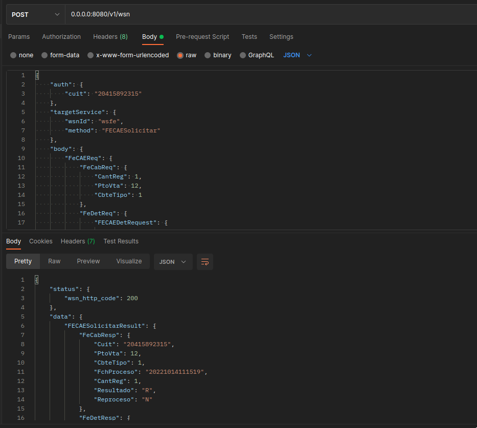

# Afip-ws-ts
Consume Afip Ws using an abstraction layer Rest Http as middleware.

# Table of contents:
- [Architecture Afip WS.](#arquitectura_ws_afip)
- [Features.](#features)
- [Overview.](#overview)
- [Usage.](#usage)
  - [Manual Steps.](#manual_steps)
  - [Install.](#install)
  - [Test.](#test)
  - [Run.](#run)
  - [Consume.](#consume)


## Architecture Afip WS. <a name="arquitectura_ws_afip"></a>

El intercambio de información entre _AFIP y los Entes Externos_ (EE) se implementa a través de _Web Services SOAP_.
Existen dos tipos de Web Services:
- **WSAA**: Web Service de Autenticación y Autorización.
- **WSN**: Web Services de negocio (_wsseg - R.G. N° 2.668, wsfexv1 - R.G. N° 2.758, wsct - R.G. N° 3.971,
wsfev1 - R.G. N° 4.291, wsmtxca - R.G. N° 2.904 Y wsbfev1- R.G. N° 2.557_).

Los **WSN** son públicos y accesible directamente a través de Internet.
Todos contienen una cabecera **Auth** donde se deben enviar los tres datos clave que componen el objeto de autorización:
```javascript
// cabecera auth
{
    cuit: '30415892315'
    token: 'PD94bWwgdmVyc25kYWxvbmU9InllcyI...'
    sign: 'CiAgICA8aWQ1VJVCAzMzY5MzQ1MDIzOS...'
}
```
Para conseguir el **token** y **sign**, los clientes deben autenticarse en el WSAA para conseguir el objeto **Auth**.
Cada combinación de _token, sign y cuit_ es válida para un WSN en particular y tiene una validez limitada de 24hs.

La autenticación del cliente se realiza utilizando criptografía de clave pública basada en certificados digitales X.509.
Esto significa que para conseguir el objeto Auth, se debe solicitar a Afip el certificado digital correspondiente bajo
la CUIT que desea consumir el WSN como una EE.

## Features. <a name="features"></a>

El servicio _**Afip-ws-ts**_ tiene las siguiente responsabilidades:
- Proprcionar al cliente http una **capa de abstracción sobre los WSN**. Permitiendo comunicarse con ellos mediante
protocolo Http, en vez de SOAP.
- Actuar como **middleaware entre el Cliente Http y el WSAA**. Esto quiere decir que si el cliente proporciona un
certificado digital válido para una cuit determinada, la aplicación gestiona la capa de autenticación, recuperando
o generando nuevos objetos Auth, según sea necesario, para luego ejecutar el método soap sobre el WSN objetivo y
devolver la respuesta al usuario.

## Overview. <a name="overview"></a>


## Usage. <a name="usage"></a>

Este repositorio cuenta con un certificado digital válido para el ambiente de homologación(testing) de Afip,
bajo la cuit número 20415892315.
Si desea utilizarlo puede continuar a la sección [Install](#install).

En caso contrario, debe proporcionar: 
- Clave privada en private/$CUIT/private.key.
- Certificado emitido por Afip private/$CUIT/cert.pem

### Manual Steps. <a name="manual_steps"></a>

Para obtener el certificado digital el primer paso es generar una clave privada junto con un certificado CSR.
```shell
# private key open ssl:
openssl genrsa -out private/private_key.key 2048 
# or:
make private_key

# Csr open ssl:
openssl req -new -key private/private_key.key -subj "/C=ar/O=afipwsts/CN=wsaahomo/serialNumber=CUIT $CUIT" -out private/$CUIT/afip.csr
# or:
CUIT=$CUIT make csr
```

En el siguiente [instructivo](https://www.afip.gob.ar/ws/WSASS/WSASS_como_adherirse.pdf) se detalla
como adherirse al servicio de testing.
El certificado obtenido debe ser guardado en private/$CUIT/cert.pem .

Creación de request de acceso a partir de certificado .pem
```shell
openssl cms -sign -in private/$CUIT/MiLoginTicketRequest.xml -out private/$CUIT/MiLoginTicketRequest.xml.cms -signer private/$CUIT/cert.pem -inkey private/private_key.key -nodetach -outform PEM
```
Este comando genera el archivo .xml.cms con el mensaje de solicitud para ser enviado al WSAA. Internamente la aplicación
se encarga de generar este cms por usted, utiliznado el .pem y su clave privado.

### Install. <a name="install"></a>

```shell
npm install
```

### Test. <a name="test"></a>
Run unit and integration tests:
```shell
npm test
```

### Run. <a name="run"></a>
Build, test and deploy in single docker network.
```shell
make up

# then
docker ps
#CONTAINER ID   IMAGE                    COMMAND                  CREATED         STATUS         PORTS                                       NAMES
#abd3bdf3ff26   afip-ws-ts_application   "docker-entrypoint.s…"   7 seconds ago   Up 6 seconds   0.0.0.0:8080->8080/tcp, :::8080->8080/tcp   afip-ws-ts_application_1
```

### Consume. <a name="consume"></a>
Este repositorio cuenta con una [colección postman](afip-ws-ts.postman_collection.json) lista para consumir
métodos del wsfe(Factura electrónica) y wsfex(Factura electrónica de exportación).


